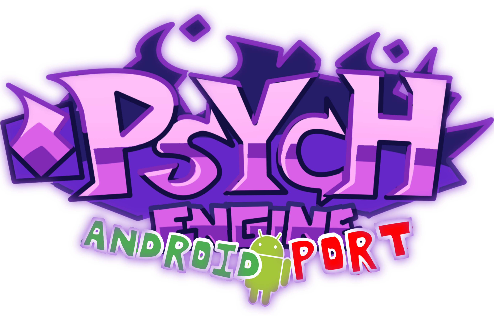

### Psych Engine Android Port

_____________________________________

Engine originally used on [Mind Games Mod](https://gamebanana.com/mods/301107), intended to be a fix for the vanilla version's many issues while keeping the casual play aspect of it. Also aiming to be an easier alternative to newbie coders.

## Installation:
You must have [the most up-to-date version of Haxe](https://haxe.org/download/), seriously, stop using 4.1.5, it misses some stuff.

Follow a Friday Night Funkin' source code compilation tutorial, after this you will need to install LuaJIT.

To install LuaJIT do this: `haxelib git linc_luajit https://github.com/jigsaw-4277821/linc_luajit` on a CMD/PowerShell window

...Or if you don't want your mod to be able to run .lua scripts, delete the "LUA_ALLOWED" line on Project.xml

If you get an error about StatePointer when using Lua, run `haxelib remove linc_luajit` into CMD/PowerShell, then re-install linc_luajit.
_____________________________________

### PsychEngine's Build Instructions For Android:

1. Download
* [JDK](https://www.oracle.com/java/technologies/javase/javase-jdk8-downloads.html) - Download version `11` of it
* [Android Studio](https://developer.android.com/studio) - I recomend you to download the latest version
* [NDK](https://developer.android.com/ndk/downloads/older_releases?hl=fi) - Download version `r21e` (This is the version recomended by Lime)

2. Install JDK, Android Studio 
Unzip the NDK (the NDK does not need to be installed because its a zip archive)

3. We need to set up Android Studio for this go to android studio and find android sdk (in settings -> Appearance & Behavior -> system settings -> android sdk)


4. You Need to install extension-androidtools

To install `extension-androidtools` run this: `haxelib git extension-androidtools https://github.com/jigsaw-4277821/extension-androidtools` on a CMD/PowerShell window

5. And run command `lime setup android` in CMD/PowerShell (You need to insert the program paths)

6. Open project in CMD/PowerShell `cd (path to fnf source)`
And run command `lime build android -final`
The apk will be generated in this path (path to source)\export\release\android\bin\app\build\outputs\apk\debug
_____________________________________

If you want video support on your mod, simply run `haxelib install hxCodec` on a CMD/PowerShell window

Otherwise, you can delete the "VIDEOS_ALLOWED" Line on Project.xml

## Psych Engine Credits
* Shadow Mario - Programmer
* RiverOaken - Artist
* Yoshubs - Assistant Programmer

### Psych Engine Special Thanks
* bbpanzu - Ex-Programmer
* shubs - New Input System
* SqirraRNG - Crash Handler and Base code for Chart Editor's Waveform
* KadeDev - Fixed some cool stuff on Chart Editor and other PRs
* iFlicky - Composer of Psync and Tea Time, also made the Dialogue Sounds
* PolybiusProxy - .MP4 Video Loader Library (hxCodec)
* Keoiki - Note Splash Animations
* Smokey - Sprite Atlas Support
* Nebula the Zorua - LUA JIT Fork and some Lua reworks

### Psych Engine Android Support
* Saw (M.A. Jigsaw) - All the things needed for this engine to support android
* NK (me!) - Archive release in This fork
_____________________________________

# Psych Engine Features

## Attractive animated dialogue boxes:


## PsychEngine's Mod Support
* Probably one of the main points of this engine, you can code in .lua files outside of the source code, making your own weeks without even messing with the source!
* Comes with a Mod Organizing/Disabling Menu.

## Atleast one change to every week (PsychEngine)
### Week 1:
  * New Dad Left sing sprite
  * Unused stage lights are now used
### Week 2:
  * Both BF and Skid & Pump does "Hey!" animations
  * Thunders does a quick light flash and zooms the camera in slightly
  * Added a quick transition/cutscene to Monster
### Week 3:
  * BF does "Hey!" during Philly Nice
  * Blammed has a cool new colors flash during that sick part of the song
### Week 4:
  * Better hair physics for Mom/Boyfriend (Maybe even slightly better than Week 7's :eyes:)
  * Henchmen die during all songs. Yeah :(
### Week 5:
  * Bottom Boppers and GF does "Hey!" animations during Cocoa and Eggnog
  * On Winter Horrorland, GF bops her head slower in some parts of the song.
### Week 6:
  * On Thorns, the HUD is hidden during the cutscene
  * Also there's the Background girls being spooky during the "Hey!" parts of the Instrumental

## Cool new Chart Editor changes and countless bug fixes

* You can now chart "Event" notes, which are bookmarks that trigger specific actions that usually were hardcoded on the vanilla version of the game.
* Your song's BPM can now have decimal values
* You can manually adjust a Note's strum time if you're really going for milisecond precision
* You can change a note's type on the Editor, it comes with two example types:
  * Alt Animation: Forces an alt animation to play, useful for songs like Ugh/Stress
  * Hey: Forces a "Hey" animation instead of the base Sing animation, if Boyfriend hits this note, Girlfriend will do a "Hey!" too.

## Multiple editors to assist you in making your own Mod

* Working both for Source code modding and Downloaded builds!

## PsychEngine's Story mode menu rework

* Added a different BG to every song (less Tutorial)
* All menu characters are now in individual spritesheets, makes modding it easier.

## Credits menu

* You can add a head icon, name, description and a Redirect link for when the player presses Enter while the item is currently selected.

## Awards/Achievements
* The engine comes with 16 example achievements that you can mess with and learn how it works (Check Achievements.hx and search for "checkForAchievement" on PlayState.hx)

## Options menu
* You can change Note colors, Delay and Combo Offset, Controls and Preferences there.
 * On Preferences you can toggle Downscroll, Middlescroll, Anti-Aliasing, Framerate, Low Quality, Note Splashes, Flashing Lights, etc.

## Other PsychEngine gameplay features
* When the enemy hits a note, their strum note also glows.
* Lag doesn't impact the camera movement and player icon scaling anymore.
* Some stuff based on Week 7's changes has been put in (Background colors on Freeplay, Note splashes)
* You can reset your Score on Freeplay/Story Mode by pressing Reset button.
* You can listen to a song or adjust Scroll Speed/Damage taken/etc. on Freeplay by pressing Space.
_____________________________________

### Friday Night Funkin'


a Game originally made for Ludum Dare 47 "Stuck In a Loop".

> Uh oh! Your tryin to kiss ur hot girlfriend, but her MEAN and EVIL dad is trying to KILL you! He's an ex-rockstar, the only way to get to his heart? The power of music... 

Play the Ludum Dare prototype here: https://ninja-muffin24.itch.io/friday-night-funkin
Play the Newgrounds one here: https://www.newgrounds.com/portal/view/770371
Support the project on the itch.io page: https://ninja-muffin24.itch.io/funkin

IF YOU MAKE A MOD AND DISTRIBUTE A MODIFIED / RECOMPILED VERSION, YOU MUST OPEN SOURCE YOUR MOD AS WELL

### Credits / shoutouts

- [ninjamuffin99](https://twitter.com/ninja_muffin99) - Programmer
- [PhantomArcade3K](https://twitter.com/phantomarcade3k) and [Evilsk8r](https://twitter.com/evilsk8r) - Art
- [Kawaisprite](https://twitter.com/kawaisprite) - Musician

FNF was made with love to Newgrounds and its community. Extra love to Tom Fulp.

## Build instructions

THESE INSTRUCTIONS ARE FOR COMPILING THE FNF'S SOURCE CODE!!!

IF YOU WANT TO JUST DOWNLOAD AND INSTALL AND PLAY FNF NORMALLY, GO TO ITCH.IO TO DOWNLOAD THE GAME FOR PC, MAC, AND LINUX!!

https://ninja-muffin24.itch.io/funkin

IF YOU WANT TO COMPILE FNF YOURSELF, CONTINUE READING!!!

### Installing the Required Programs

First, you need to install Haxe and HaxeFlixel. I'm too lazy to write and keep updated with that setup (which is pretty simple). 
1. [Install Haxe 4.1.5](https://haxe.org/download/version/4.1.5/) (Download 4.1.5 instead of 4.2.0 because 4.2.0 is broken and is not working with gits properly...)
2. [Install HaxeFlixel](https://haxeflixel.com/documentation/install-haxeflixel/) after downloading Haxe

Other installations you'd need are the additional libraries, a fully updated list will be in `Project.xml` in the project root. Currently, these are all of the things you need to install:
```
flixel
flixel-addons
flixel-ui
hscript
newgrounds
```
So for each of those type `haxelib install [library]` so shit like `haxelib install newgrounds`

You'll also need to install a couple things that involve Gits. To do this, you need to do a few things first.
1. Download [git-scm](https://git-scm.com/downloads). Works for Windows, Mac, and Linux, just select your build.
2. Follow instructions to install the application properly.
3. Run `haxelib git polymod https://github.com/larsiusprime/polymod.git` to install Polymod.
4. Run `haxelib git discord_rpc https://github.com/Aidan63/linc_discord-rpc` to install Discord RPC.

You should have everything ready for compiling the game! Follow the guide below to continue!

At the moment, you can optionally fix the transition bug in songs with zoomed-out cameras.
- Run `haxelib git flixel-addons https://github.com/HaxeFlixel/flixel-addons` in the terminal/command-prompt.

### Ignored files (FNF)

I gitignore the API keys for the game so that no one can nab them and post fake high scores on the leaderboards. But because of that the game
doesn't compile without it.

Just make a file in `/source` and call it `APIStuff.hx`, and copy & paste this into it

```haxe
package;

class APIStuff
{
	public static var API:String = "";
	public static var EncKey:String = "";
}

```

and you should be good to go there.

### Compiling FNF
NOTE: If you see any messages relating to deprecated packages, ignore them. They're just warnings that don't affect compiling

Once you have all those installed, it's pretty easy to compile the game. You just need to run `lime test html5 -debug` in the root of the project to build and run the HTML5 version. (command prompt navigation guide can be found here: [https://ninjamuffin99.newgrounds.com/news/post/1090480](https://ninjamuffin99.newgrounds.com/news/post/1090480))
To run it from your desktop (Windows, Mac, Linux) it can be a bit more involved. For Linux, you only need to open a terminal in the project directory and run `lime test linux -debug` and then run the executable file in export/release/linux/bin. For Windows, you need to install Visual Studio Community 2019. While installing VSC, don't click on any of the options to install workloads. Instead, go to the individual components tab and choose the following:
* MSVC v142 - VS 2019 C++ x64/x86 build tools
* Windows SDK (10.0.17763.0)

Once that is done you can open up a command line in the project's directory and run `lime test windows -debug`. Once that command finishes (it takes forever even on a higher end PC), you can run FNF from the .exe file under export\release\windows\bin
As for Mac, 'lime test mac -debug' should work, if not the internet surely has a guide on how to compile Haxe stuff for Mac.

### Additional guides

- [Command line basics](https://ninjamuffin99.newgrounds.com/news/post/1090480)
